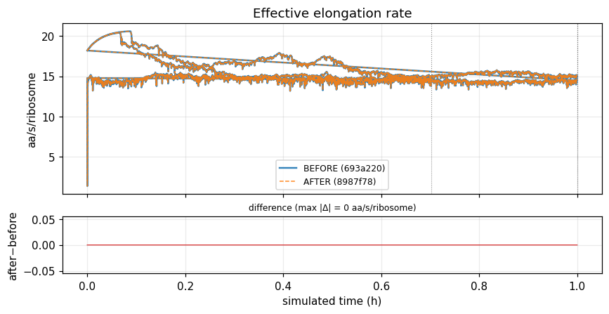
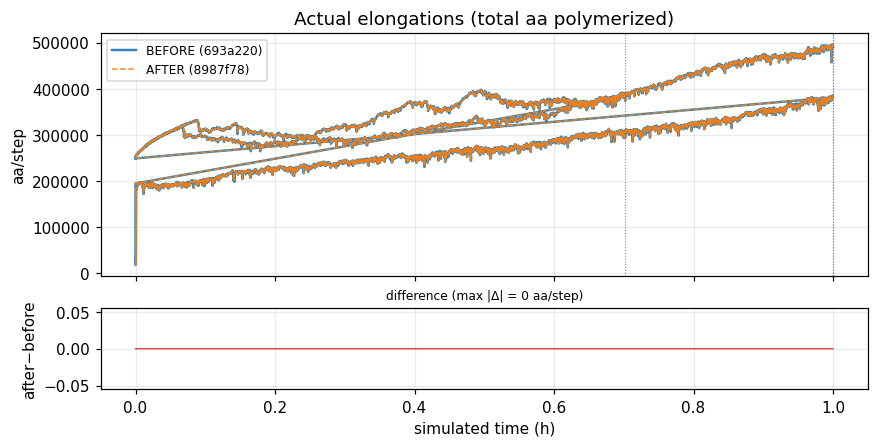
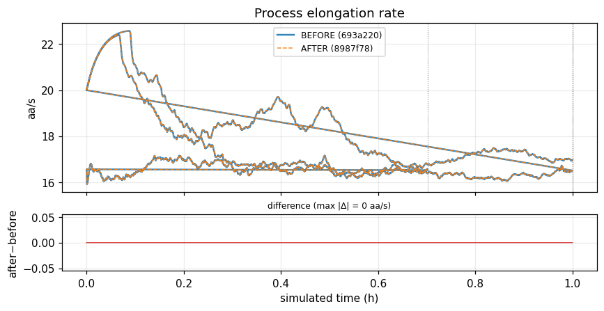
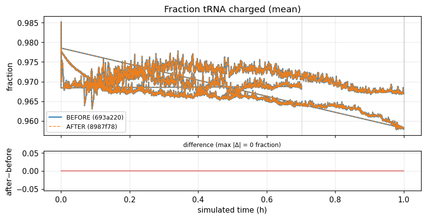
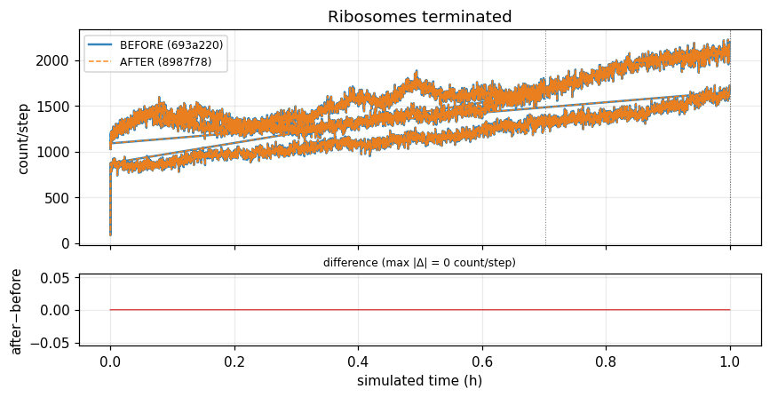
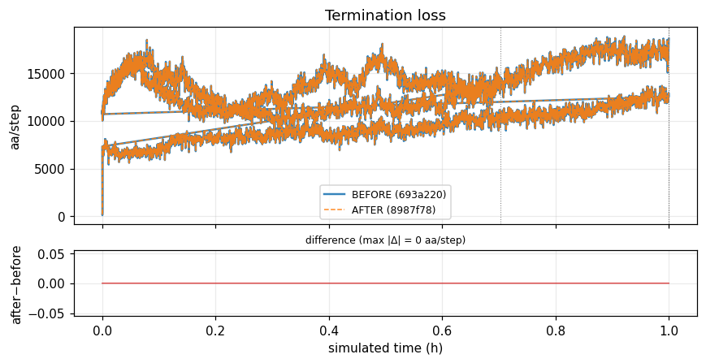
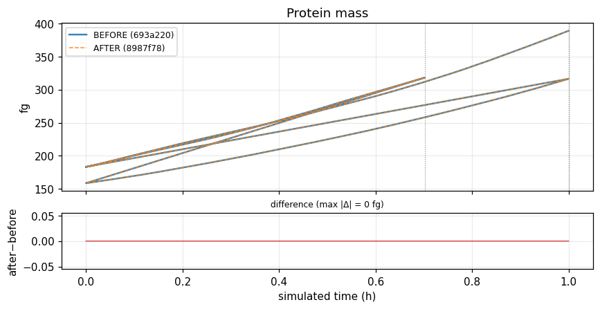
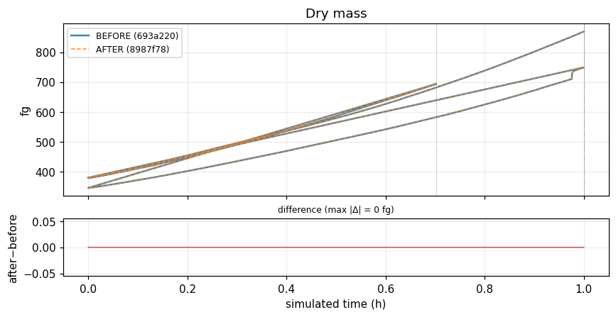
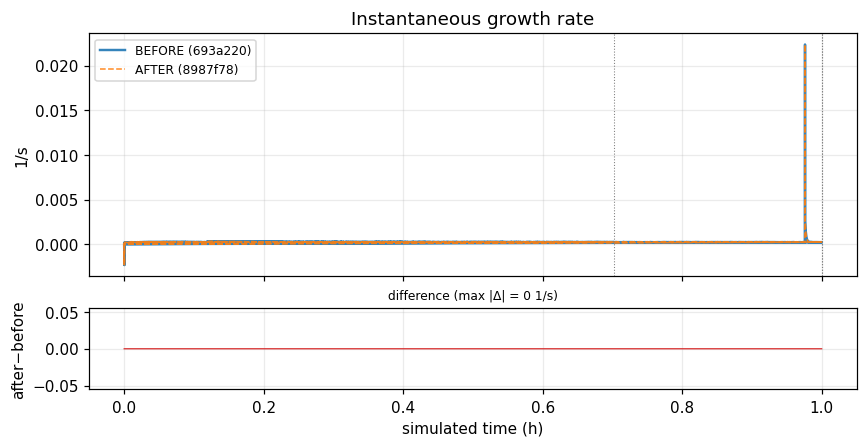

# Polypeptide elongation — behavioral comparison across the v2ecoli refactor

**BEFORE** = `693a220` (strategy-class models) · **AFTER** = `8987f78` (wireable process chain) · 3 generations · seed 0

✅ **BIT-IDENTICAL** — every one of the 130 elongation/mass listeners matches exactly across all 3 generations (Δ = 0 everywhere).

| metric | value |
|---|---|
| elongation/mass listeners compared | 130 |
| bit-identical | 130 |
| within 1e-6 | 130 |
| aligned time points (3 gens) | 9,731 |

## 1. What changed in the code

**BEFORE — strategy classes.** One host `PolypeptideElongation(PartitionedProcess)` (~1342 lines) delegated the five elongation hooks to a plain-object model chosen **at runtime by config flags** (`if trna_charging: SteadyStateElongationModel(...) elif translation_supply: ... else: BaseElongationModel(...)`); models lived in `polypeptide/elongation_models.py` (~755 lines) and reached the host via `self.process.X`.

**AFTER — wireable process chain.** Three sibling `PartitionedProcess` classes via inheritance in `polypeptide_elongation.py` (~1811 lines): `BasePolypeptideElongation → TranslationSupplyPolypeptideElongation → SteadyStatePolypeptideElongation`. `elongation_models.py` deleted; the `trna_charging`/`translation_supply` flags removed. Variant selected **by wiring** (`composites/_helpers.py: 'ecoli-polypeptide-elongation': SteadyStatePolypeptideElongation`).

The baseline runs the **SteadyState charging model in both versions**, so a faithful comparison holds the model fixed (see Methodology).

## 2. Behavioral result over 3 generations

Division timing / tick grid (identical):

| Generation | AFTER end | BEFORE end | match |
|---|---|---|---|
| gen 0 | 2528s / 2529 ticks | 2528s / 2529 ticks | ✓ |
| gen 1 | 3600s / 3601 ticks | 3600s / 3601 ticks | ✓ |
| gen 2 | 3600s / 3601 ticks | 3600s / 3601 ticks | ✓ |

#### Effective elongation rate

#### Actual elongations (total aa polymerized)

#### Process elongation rate

#### Fraction tRNA charged (mean)

#### Ribosomes terminated

#### Termination loss

#### Protein mass

#### Dry mass

#### Instantaneous growth rate

## 3. Largest deviations

_None — every compared listener is within tolerance._

## Methodology

- Both versions build their runtime cache from the same shipped ParCa fixture (`models/parca/parca_state.pkl.gz`); the resulting `initial_state.json` is **byte-identical** (md5 verified) — molecular inputs held constant.
- Each version runs its **own canonical baseline** (SteadyState charging model), seed 0, 3 generations, via `v2ecoli-workflow` + ParquetEmitter. Outputs aligned on `(generation, global_time)`; every `listeners__*` column the elongation process writes (scalars + per-amino-acid arrays) plus global mass/growth is compared element-wise.
- **Caveat (multi-generation realism):** the cache is built from the committed ParCa fixture (`models/parca/parca_state.pkl.gz`). Gen 0 divides naturally at ~2528s (inside the model's 2400–2700s band); daughters (gens 1–2) grow past a full doubling (2.17× / 2.29×) but do not re-initiate division within the `max_duration_per_gen=3600s` cap — a replication-initiation limitation of the committed debug-grade fixture (see the AGENTS.md note). Present **identically in both runs**, so it does not affect the before/after conclusion; "3 generations" here = one natural division + two capped over-growth slots.
- **Confound found & controlled:** an initial run compared BEFORE against a cache built by AFTER's `build_cache.py` (which had dropped the now-dead `trna_charging` config key); BEFORE then silently ran the non-charging Base model, faking large deviations. Rebuilding BEFORE's own canonical cache restored the apples-to-apples result above. The new regression tests in this PR guard against exactly that class of failure.

> A fully self-contained HTML version (interactive, all 130 listeners) is committed alongside this file as `report.html`.
