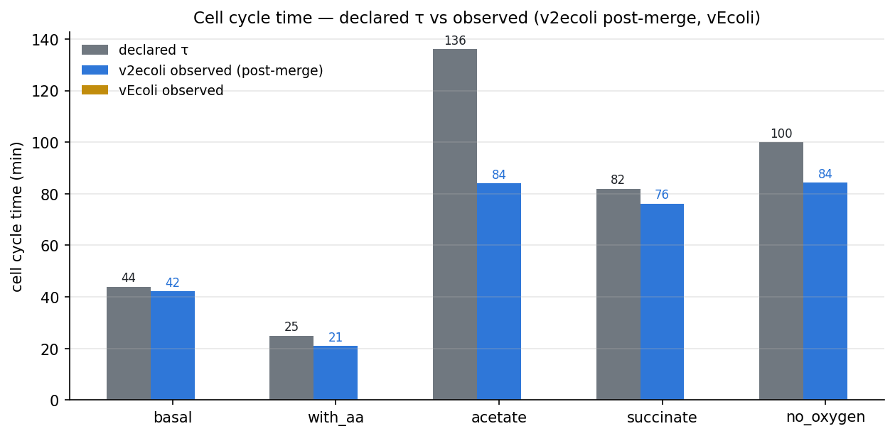
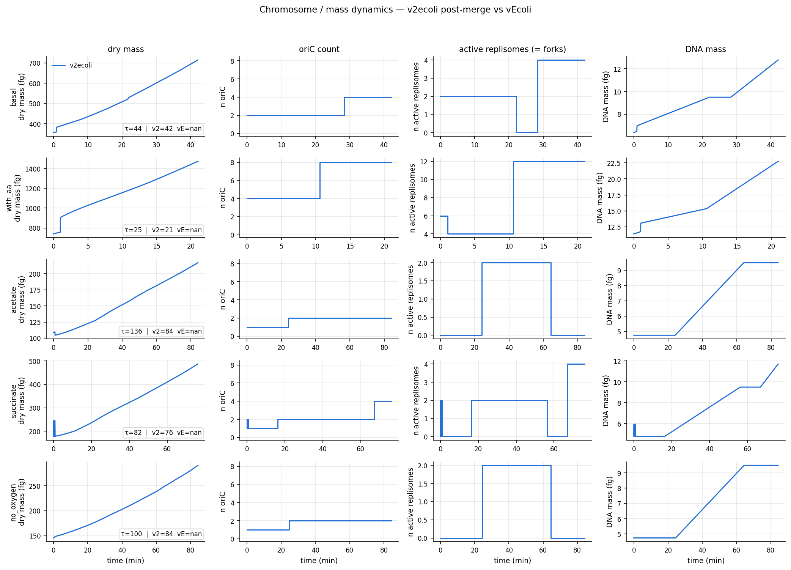
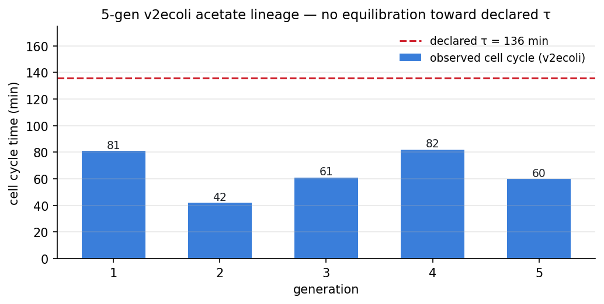

# Acetate cycle time runs ~80 min in both v2ecoli and vEcoli vs declared τ=136 min

`condition_defs.tsv` declares **τ=136 min** for `acetate`, but a 1-gen sim divides at **~80 min** in both v2ecoli and vEcoli (a 41% undershoot). The other four canonical conditions (basal, with_aa, succinate, no_oxygen) all match declared τ within 20%. So the mismatch is acetate-specific and is inherited from vEcoli — the v2ecoli port reproduces it faithfully.

| Condition | declared τ | v2ecoli | vEcoli |
|-----------|-----------:|--------:|-------:|
| basal     | 44   | 42 | 40 |
| with_aa   | 25   | 21 | 20 |
| **acetate** | **136** | **80** | **80** |
| succinate | 82   | 80 | 73 |
| no_oxygen | 100  | 86 | 87 |

Not a first-gen transient: a 5-gen v2ecoli acetate lineage cycles **81 / 42 / 61 / 82 / 60 min** — bouncing in the 40–80 min range with no trend toward 136 min.

Separately, a small wiring fix worth landing upstream: v2ecoli's `Division` step (`v2ecoli/steps/division.py`) was gating on mass + chromosome count, not on the `divide` boolean from `MarkDPeriod`. vEcoli's default gates on `MarkDPeriod.divide`. After wiring `division_variable = MarkDPeriod.divide` in `v2ecoli/composites/_helpers.py`, `with_aa` cycle drops 45 min → 22.5 min, matching vEcoli. If anyone is strictly concerned about D-period values or division timing in v2ecoli, this is the trigger to use.
