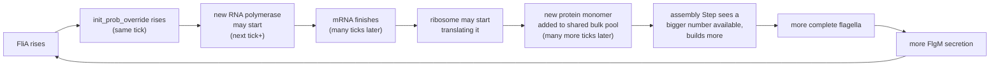

# The Flagellar Regulatory & Assembly Cascade — Biology Paired to Code

*Every biological claim below is paired with the exact file/line in v2ecoli that implements it.*

---

## Class I — FlhD4C2 master regulator

- **Biology:** FlhD4C2 heterohexamer (4x FlhD + 2x FlhC) activates all Class II promoters.
- **Code:** assembled via the *unmodified* `CPLX0-3930_RXN` complexation reaction (not a custom Step) — its own transcription is untouched; it only enters the regulation math as a bulk count read in `flagella_transcription_regulation.py:187` (`flhDC_count = counts(states["bulk"], self.flhDC_idx)`).

## Class II / Class III — the SUM-gate
`v2ecoli/processes/flagella_transcription_regulation.py`

- **Biology:** two normalized signals, X (FlhDC saturation) and Y (free FliA saturation), drive gene expression via Michaelis-Menten terms.
  - **Code:** lines 190-191 — `X = flhDC_count / (K_flhDC + flhDC_count)`, `Y = fliA_count / (K_fliA + fliA_count)`.
- **Biology:** Class II genes integrate X and Y with per-gene weights (beta, beta') — Kalir & Alon's bilinear SUM gate.
  - **Code:** weights are `config_schema["beta"]` / `["beta_prime"]`, lines 81-83, one value per of the 7 Class II TUs; the gate itself is computed at line 200: `p_i = (beta*X + beta_prime*Y) / (beta+beta_prime)`.
- **Biology:** gate output is normalized so it equals ParCa's basal probability exactly at reference (t=0) conditions.
  - **Code:** `X_ref`/`p_i_ref` captured once on the first call, lines 195-197; applied at lines 205-212 (`init_prob_override_new[rows] = p_i[i] / safe_p_i_ref[i] * flg_classII_basal_probs[i]`).
- **Biology:** Class III genes depend on free FliA *alone*, not FlhDC.
  - **Code:** lines 214-219 — `init_prob_override_new[rows] = Y * self.flg_classIII_basal_probs[j]`, looped separately over `flg_classIII_TU_ids`.
- **Biology:** this bypasses ordinary TF-binding to avoid double-counting.
  - **Code:** line 222 — writes straight to `promoters["set"]["init_prob_override"]`, which `transcript_initiation` substitutes directly (see module docstring lines 30-32 for why).

## Step 1 — MS-ring + C-ring
`flagella_motor_switch_assembly.py`

- **Biology:** FliF (MS-ring) forms first, then FliG/FliM/FliN (C-ring) assemble onto it — real order per Minamino & Namba 2008.
  - **Code:** `_REQUIREMENTS` dict, lines 78-83 — FliF:34, FliG:34, FliM:34, FliN:111; FliF was added here specifically in the "MS-RING ORDERING FIX" (line 45 comment).
- **Biology:** ordinary complexation is fast — not rate-limited.
  - **Code:** `update()`, lines 136-152 — `n_formed = min(available // per_unit)`, converts as much as material allows every single tick (no rate constant anywhere in this Step).

## Step 2 — Export apparatus (Type III secretion system)
`flagella_export_apparatus_assembly.py`

- **Biology:** FlhA(x9)/FlhB/FliO/FliP:FliQ:FliR(5:4:1)/FliH(x12)/FliI(x6)/FliJ insert into the pre-formed ring.
  - **Code:** `_REQUIREMENTS`, lines 61-72, one entry per protein with its real stoichiometric coefficient and citation in the header comment (lines 37-43).
- **Biology:** this reaction now depends on the C-ring existing first (real hierarchy).
  - **Code:** `"CPLX0-7450[i]": 1` at line 62 — added in the "HIERARCHY FIX," explained lines 16-27.
- **Biology:** FlhA-FlhB binding kinetics have a real measured rate constant (McMurry et al. 2015).
  - **Code:** not used *inside* this Step directly (it's deterministic, not kinetic) — that rate constant instead lives in the NFsim side of the project (`K_ON_FLHA_FLHB_MOLAR` in `generate_flagella_bngl.py`), used as the general binding-rate anchor there.

## Step 3 — Motor complex / basal body
`flagella_motor_complex_assembly.py`

- **Biology:** L-ring/P-ring (FlgH/FlgI x26), stator (MotA x55 / MotB x22), rod (FlgB/C/F proximal, FlgG x24 distal), FliL, FliE.
  - **Code:** `_REQUIREMENTS`, lines 78-88.
- **Biology:** C-ring and MS-ring are *not* consumed again here — already folded in via CPLX0-7451.
  - **Code:** lines 68-77 — old requirements kept as comments (`# "CPLX0-7450[i]": 1`, `# "FLIF-FLAGELLAR-MS-RING[i]": 34`) with the hierarchy-fix explanation directly above (lines 33-49).

## Step 4 — Hook nucleation
`flagella_filament_nucleation.py`

- **Biology:** nucleating a *new* flagellum is rare — existing structures absorb excess subunit instead (Chang/Sung/Hong 2025).
  - **Code:** `nucleation_rate` config default 0.00167 (line 126); converted to a fixed interval — `self.nucleation_interval = 1.0 / self.nucleation_rate` (line 150) — fires exactly one event per interval, not a per-tick probability.
- **Biology:** consumes 1 motor complex + 120 FlgE + 11 FlgK + 11 FlgL — matches everything CPLX0-7452 needs except the filament itself.
  - **Code:** `_NUCLEATION_REQUIREMENTS`, lines 95-100.
- **Biology/engineering note:** the first tick must not fire immediately (rate limiting has to apply from t=0 too).
  - **Code:** `first_call` guard, lines 164, 169-176 — first call only starts the clock, documented as the "SECOND BUG FOUND AND FIXED" (lines 58-72).

## Step 5 — Filament elongation
`flagella_filament_elongation.py`

- **Biology:** FliC is added at the distal tip via injection-diffusion; rate slows as the filament lengthens (Renault et al. 2017).
  - **Code:** rate formula implemented at line 206 — `desired = round(rate_a / (rate_b + lengths) * dt)`; constants `rate_a=26450.0`, `rate_b=575.0` at lines 156-157.
- **Biology:** simultaneous filaments compete for the same free-FliC pool.
  - **Code:** fair-share scaling, lines 210-216 — `scale = fliC_available / total_desired`.
- **Biology:** target length is a real (short-range) literature value, not arbitrary.
  - **Code:** `TARGET_LENGTH = 5000` at line 129, with the 20,000 -> 10,000 -> 5,000 revision history kept as comments (line 127) and justified in the docstring (lines 81-105).
- **Biology:** completion requires the cap protein FliD (x5) and produces one real complete flagellum.
  - **Code:** `fliD_per_completion` config default 5 (line 152); completion check `did_complete = new_lengths >= target_length` (line 219).

## The checkpoint — FlgM secretion
`flagella_flgm_secretion.py`

- **Biology:** complete flagella actively pump FlgM out; this shifts the FlgM-FliA equilibrium to free FliA.
  - **Code:** `update()`, lines 96-117 — reads `hbb_count` (line 102) and `flgM_count` (line 103), computes export at lines 105-112.
- **Biology:** export rate calibrated from real FlgM half-life measurements (~30min -> ~2min).
  - **Code:** `secretion_rate` config default 0.1, line 70 (with the calibration math in the comment directly above, lines 67-70).
- **Biology/simplification flagged directly in the code:** real trigger is hook completion (FliK-sensed), not full filament completion — this Step uses the latter as a practical proxy.
  - **Code:** `hbb_id` default `"CPLX0-7452[j]"` (line 66), with the justification written directly in the docstring, lines 24-27.
- **Biology:** exported amount never exceeds available FlgM (mass balance).
  - **Code:** line 110 — `min(int(flgM_count), int(round(hbb_count * secretion_rate * timestep)))`.

## What's missing — FlhDC degradation

- **Biology:** FliT-mediated degradation is real in *Salmonella* but shown absent in *E. coli* K-12 (Albanna et al. 2018).
  - **Code:** fully removed from `ecoli_baseline.py`'s active `flagella_regulation` step list — visible only as commented-out history at lines 546-563 (`# 'ecoli-flit-flhdc-checkpoint'`), and the reasoning is in the block comment at lines 500-518.
- **Biology:** YdiV is the planned real replacement, not yet verified for K-12.
  - **Code:** doesn't exist yet anywhere in the codebase — no file, no Step, no reaction. Purely a literature-search + NFsim-implementation task (task #33 on the list).
- **Biology:** consequence — no decay pathway for FlhD4C2 at all right now.
  - **Code:** confirmed by absence — `protein_degradation.py` only ever touches monomers (never queried against CPLX0-3930), and no other Step in the active `flagella_regulation` list references it as a reactant.

---

## Appendix: full pipeline order (as wired in `ecoli_baseline.py`)

1. `ecoli-flagella-motor-switch-assembly`
2. `ecoli-flagella-export-apparatus-assembly`
3. `ecoli-flagella-motor-complex-assembly`
4. `ecoli-flagella-filament-nucleation`
5. `ecoli-flagella-filament-elongation`
6. `ecoli-flagella-flgm-secretion`
7. `ecoli-flagella-transcription-regulation`

All `before_steps` on `ecoli-transcript-initiation`; opt-in only via `enable_features('flagella_regulation')`.

## Why execution order doesn't need to match this loop

A natural question when looking at the execution order above: shouldn't regulation run *before* assembly, since regulation is what supplies the protein assembly consumes? Answered directly, empirically, added 2026-08-12:

**No — because nothing regulation decides *this tick* can reach the protein pool *this tick* anyway.** Regulation's output is a live, same-tick readout of the current FliA count (`init_prob_override` is recomputed fresh every single tick, immediately tracking FliA) — but turning that readout into an actual new protein molecule requires `transcript_initiation` -> `transcript_elongation` (many ticks to transcribe a gene) -> `polypeptide_initiation` -> `polypeptide_elongation` (many more ticks to translate it). That real, multi-hundred-tick delay exists regardless of where any Step sits in the per-tick execution list — moving step order around cannot close a gap caused by real RNA-polymerase/ribosome kinetics.

Meanwhile, assembly Steps each tick consume from a **shared bulk pool** that was stocked by transcription/translation decisions made long ago — not by anything regulation decided this tick. Verified directly (`diagnostic_transcription_to_protein_lag.py`): a burst of free FliC protein (0 -> 10,807 -> 17,576) appeared in the first ~600s of a diagnostic run, entirely from mRNA/ribosomes that already existed *before the run started* -- completely unrelated to that run's own regulatory changes, which only began meaningfully affecting `init_prob_override` around t~1000s onward.

### The full story, as a loop (not a line)

**Shown starting at regulation for clarity** — in a real running cell this loop is always mid-cycle, with assembly continuously drawing on protein synthesized during *earlier* iterations of this same loop, not waiting for the iteration being described. There is no true "first" step; regulation is simply a clean, illustrative point to begin explaining a process that is, in reality, always already in motion.
